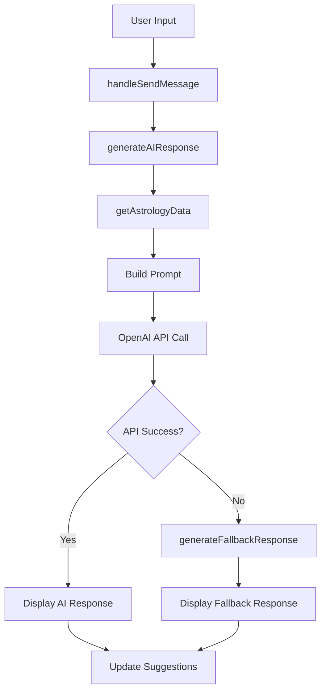

# AIチャット機能 - 技術仕様書

**仕様書バージョン**: 1.0  
**作成日**: 2025年1月17日  
**対象システム**: Starflect AIチャット機能

---

## 📖 概要

### 機能概要
Starflectプラットフォームにおける対話型AI占い師機能。ユーザーの出生データと占星術分析結果を活用し、個人化されたアドバイスを提供する。

### 主要機能
- 🤖 **AI占い師との対話**: OpenAI APIを使用した自然言語対話
- 🔮 **個人化された回答**: 出生データ・占星術分析結果を活用
- 💬 **多様な相談カテゴリ**: 恋愛・仕事・健康・金運・人間関係等
- 🎯 **質問提案システム**: 25種類の詳細質問サンプル
- 🔄 **毎回異なる応答**: プロンプト最適化による多様性確保

---

## 🏗️ システム アーキテクチャ

### コンポーネント構成

```
AIFortuneChat (React Component)
├── Message Management
│   ├── handleSendMessage()
│   ├── generateAIResponse()
│   └── generateFallbackResponse()
├── Data Integration
│   ├── getAstrologyData()
│   ├── getSunSign()
│   └── birthData management
├── UI Components
│   ├── Message Display
│   ├── Input Interface
│   └── Suggestion Chips
└── Navigation
    ├── Back Button
    └── Home Link
```

### データフロー



---

## 🔧 技術仕様

### 主要ファイル
- **メインコンポーネント**: `src/components/AIFortuneChat.tsx`
- **ルーティング設定**: `src/App.tsx`
- **AI分析ユーティリティ**: `src/utils/aiAnalyzer.ts`
- **スタイル**: `src/components/AIFortuneChat.css`

### 依存関係
```json
{
  "react": "^18.x",
  "react-router-dom": "^6.x",
  "@types/react": "^18.x"
}
```

### 外部API
- **OpenAI GPT-4**: チャット機能のバックエンド
- **環境変数**: `VITE_OPENAI_API_KEY`

---

## 📋 機能詳細仕様

### 1. メッセージ送信機能

#### `handleSendMessage(text: string)`
```typescript
interface Message {
  id: string;
  text: string;
  isUser: boolean;
  timestamp: Date;
  typing?: boolean;
}
```

**処理フロー**:
1. ユーザーメッセージをstateに追加
2. `generateAIResponse()`を呼び出し
3. 1.5秒のタイピング効果
4. AI応答をstateに追加
5. 提案チップを更新

### 2. AI応答生成機能

#### `generateAIResponse(question: string): Promise<string>`

**プロンプト構成**:
```typescript
const prompt = `
あなたは経験豊富で心温かい占い師です。

【重要】毎回新しい視点で分析し、異なる角度からのアドバイスを提供してください。

相談者の質問: ${question}
分析実行時刻: ${timestamp} - 分析ID: ${randomId}

【参考情報】
相談者: ${userName}さん
${astrologyData} // 10天体分析・3天体分析・太陽星座

【回答方針】
- 相談者の気持ちに寄り添い、共感を示してください
- 具体的で実践的なアドバイスを含めてください
- 希望と前向きな視点を提供してください
- 占星術的な観点を適度に織り交ぜてください
- 丁寧で温かい言葉遣いを心がけてください
- 前回とは異なる視点や新しい観点を必ず含めてください
`;
```

**API呼び出し**:
```typescript
const response = await chatWithAIAstrologer(
  prompt,
  safeBirthData,
  [], // 惑星データ
  [], // チャット履歴
  'general' // カテゴリ
);
```

### 3. フォールバック応答システム

#### エラー時の対応
- AI API失敗時に自動的に切り替わり
- 毎回異なる内容を生成（3つのバリエーション）
- キーワードマッチングによる関連性確保

```typescript
const responses = {
  '恋愛': [...], // 恋愛関連の詳細応答
  '仕事': [...], // 仕事関連の詳細応答
  '健康': [...], // 健康関連の詳細応答
  // ... 他のカテゴリ
};
```

### 4. 占星術データ統合

#### データ取得優先順位
1. **10天体分析**: `personality-analysis-four-sections-{key}`
2. **3天体分析**: `personality-analysis-three-signs-{key}`
3. **太陽星座**: 生年月日から算出

```typescript
interface AstrologyData {
  type: '10天体分析' | '3天体分析' | '太陽星座';
  data: {
    // 10天体分析の場合
    basicPersonality?: string;
    loveAndAction?: string;
    workAndGrowth?: string;
    // 3天体分析の場合
    combinedAnalysis?: {
      overview: string;
      basicPersonality: string;
    };
    // 太陽星座の場合
    sunSign?: string;
  };
}
```

---

## 🎨 ユーザーインターフェース

### レイアウト構成
```
┌─────────────────────────────────┐
│ Header (戻るボタン + AI情報)        │
├─────────────────────────────────┤
│                                 │
│ Messages Container              │
│ ┌─────────────────────────────┐ │
│ │ User Message                │ │
│ └─────────────────────────────┘ │
│ ┌─────────────────────────────┐ │
│ │ AI Response                 │ │
│ └─────────────────────────────┘ │
│                                 │
├─────────────────────────────────┤
│ Suggestion Chips                │
├─────────────────────────────────┤
│ Input Area + Send Button        │
└─────────────────────────────────┘
```

### 質問提案システム
**25種類の質問サンプル**:
- 恋愛運関連（5件）
- 仕事運関連（5件）
- 健康運関連（4件）
- 全体運関連（5件）
- 金運関連（3件）
- 家族関連（3件）

**表示ロジック**:
- 初期表示：ランダム5件
- 質問後：カテゴリベースフィルタリング + ランダム5件

---

## 🔐 セキュリティ・プライバシー

### データ保護
- **個人情報**: localStorageで一時保存のみ
- **チャット履歴**: セッション終了時に削除
- **API通信**: HTTPS暗号化

### エラーハンドリング
```typescript
try {
  const response = await chatWithAIAstrologer(...);
  return response;
} catch (error) {
  console.error('❌ AI占い師エラー:', error);
  return generateFallbackResponse(question);
}
```

---

## 📊 パフォーマンス仕様

### 応答時間
- **AI API呼び出し**: 1-3秒（OpenAI依存）
- **フォールバック応答**: 即座（<100ms）
- **タイピング効果**: 1.5秒（UX向上）

### キャッシュ戦略
- **出生データ**: localStorage（セッション永続化）
- **占星術分析**: localStorage（7日間有効）
- **API応答**: キャッシュなし（毎回新鮮な内容）

### エラー率目標
- **API成功率**: >95%
- **フォールバック発生率**: <5%

---

## 🧪 テスト仕様

### テストケース

#### 基本機能テスト
1. **メッセージ送信**
   - 正常なメッセージ送信
   - 空メッセージの拒否
   - 連続送信の制御

2. **AI応答生成**
   - API成功時の正常応答
   - API失敗時のフォールバック
   - 占星術データの適切な統合

3. **データ統合**
   - 10天体分析データの取得
   - 3天体分析データの取得
   - 太陽星座フォールバック

#### エラーハンドリングテスト
1. **API エラー**
   - ネットワーク障害
   - API制限エラー
   - 認証エラー

2. **データエラー**
   - 不正な出生データ
   - 破損したlocalStorageデータ
   - 型変換エラー

### デバッグ支援
```javascript
// 開発者ツールでの確認コマンド
console.log('🔍 AI応答生成開始:', question);
console.log('🔍 AI API呼び出し開始...');
console.log('✅ AI API呼び出し成功:', response.length, '文字');
console.log('🔄 フォールバック応答に切り替えます');
```

---

## 🚀 デプロイメント

### 環境設定
```bash
# 必須環境変数
VITE_OPENAI_API_KEY=sk-...

# 本番環境での確認事項
- OpenAI API制限の確認
- HTTPS証明書の有効性
- CDN設定の確認
```

### 本番監視項目
1. **API呼び出し成功率**
2. **応答時間の監視**
3. **エラーログの追跡**
4. **ユーザー利用状況**

---

## 📈 将来の拡張計画

### Phase 2 機能
1. **チャット履歴保持**: 会話コンテキストの維持
2. **音声対話**: 音声入力・出力対応
3. **画像生成**: 星座・タロットカード生成

### Phase 3 機能
1. **リアルタイム占星術**: 天体の動きに基づくリアルタイム分析
2. **コミュニティ機能**: ユーザー間の相談共有
3. **プッシュ通知**: 重要な星の動きの通知

---

## 📞 サポート・メンテナンス

### 定期メンテナンス
- **月次**: API利用状況レビュー
- **四半期**: パフォーマンス分析
- **年次**: 機能拡張計画レビュー

### トラブルシューティング
| 問題 | 原因 | 対処法 |
|------|------|---------|
| AI応答なし | API制限/ネットワーク | API設定確認、フォールバック確認 |
| エラー表示 | データ型不整合 | localStorage クリア |
| 画面表示崩れ | CSS競合 | キャッシュクリア |

---

**文書バージョン**: 1.0  
**最終更新日**: 2025年1月17日  
**次回レビュー**: 本番リリース後1ヶ月 